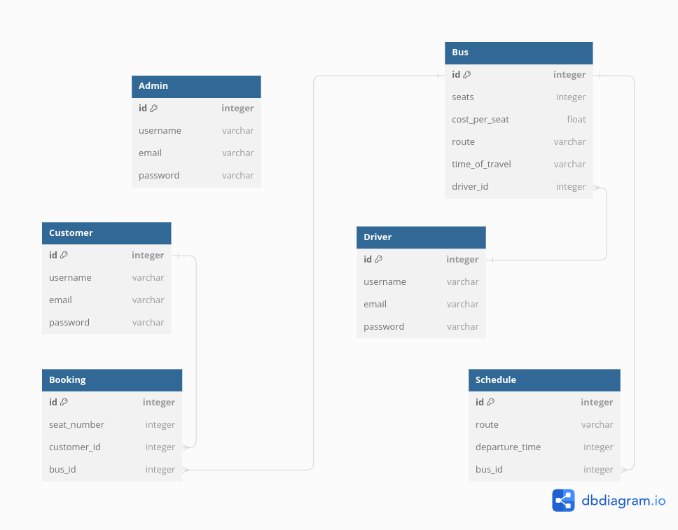

# My BUS Booking Web App

Welcome to the My BUS Booking Web App! This web application allows users to easily book bus tickets, manage reservations, and explore various bus routes. Whether you're a traveler or a bus operator, this app aims to simplify the bus booking process.

## Table of Contents

1. Features
2. Installation
3. Usage
4. Configuration
5. Contributing
6. License

## Features
1. User-friendly Interface: An intuitive and responsive design for a seamless user experience.
2. Bus Booking: Easily book bus tickets with just a few clicks.
3. Reservation Management: View and manage your bus reservations effortlessly.
4. Bus Route Exploration: Explore available bus routes and schedules.
5. Secure Payments: Ensure secure transactions with integrated payment gateways.
6. User Accounts: Create and manage user accounts for a personalized experience.

## Installation
To run the My BUS Booking Web App locally, follow these steps:

1. Clone the Repository:
git clone git@github.com:williamNyongesa/bus-booking-web-app.git

2. Navigate to the Project Directory:
cd my-bus-booking-app

3. Install Dependencies:
npm install

4. Start the Application:
npm start

5. Access the App:
Open your web browser and go to http://localhost:3000

## User Registration

1. Sign Up for a new account on the platform.
    - Click on the "Sign Up" button.
    - Fill out the required information.
    - Submit the form to create your account.

2. Bus Booking:

    - Select your departure and destination.
    - Choose your preferred date and time.
    - Complete the payment process.
3. Reservation Management:

    - View and manage your booked bus tickets in the user dashboard.
4.  Bus Route Exploration:

    - Explore available bus routes and schedules.

## Configuration
## Environment Variables
  
   - REACT_APP_API_BASE_URL: Set the base URL for the backend API.
   - REACT_APP_GOOGLE_MAPS_API_KEY: Set the Google Maps API key for map integration.

## Contributing
We welcome contributions! If you'd like to contribute to the project, please follow these steps:

1. Fork the repository.
2. Create a new branch for your feature or bug fix.
3. Make your changes and commit them.
4. Push your changes to your fork.
5. Submit a pull request to the main repository.

For major changes, please open an issue first to discuss the proposed changes.

## License
[Sign Up](https://example.com/signup)
This project is licensed under the [MIT License]()

## Figma Design Preview

Check out the Figma design for this project [here](https://www.figma.com/file/Ux13ecnDAjPcC7G28dsZ6u/Bus-Booking-App?type=design&node-id=302-94&mode=design&t=HR0rLV2IVJK0v3Dn-0).

## ERD Diagram

